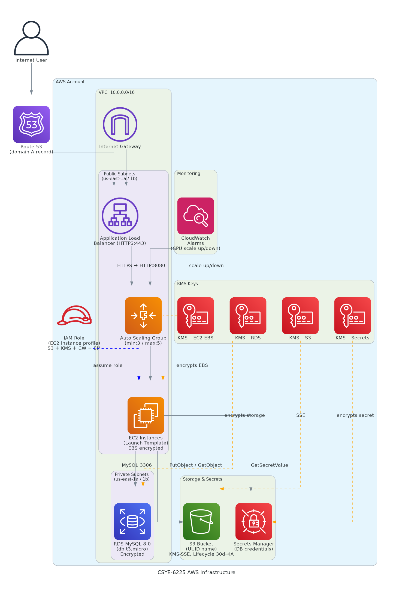

# tf-aws-infra

#### This Repository contains code for Terraform

#### The code for Web application is found in : 
https://github.com/CSYE-6225-Spring2025/webapp

## Infrastructure Diagram

#### Infrastructure Summary
This Terraform configuration provisions a complete AWS infrastructure for a web application with the following components:
Network Architecture:

1. VPC with configurable CIDR block containing:

Multiple public subnets (with auto-assigned public IPs)
Multiple private subnets across availability zones
Internet Gateway for public subnet connectivity
Route tables for public and private subnets

2. Security & Access:
   
Security Groups for:
Application instances (allows SSH and app port from ALB)
Application Load Balancer (allows HTTP/HTTPS from internet)
RDS database (allows DB port from application security group only)

3. Data Storage:
   
S3 Bucket with:
KMS encryption enabled
Lifecycle policy to transition objects to STANDARD_IA after 30 days
Force destroy enabled

RDS MySQL Database (v8.0):
Deployed in private subnets
KMS encrypted storage
Custom parameter group with increased max connections
Credentials stored in AWS Secrets Manager

4. Compute & Scaling:
   
Launch Template for EC2 instances with:
User data script that fetches DB credentials from Secrets Manager
CloudWatch agent configuration
Encrypted EBS volumes using KMS

Auto Scaling Group:
Desired capacity: 3, Min: 3, Max: 5 instances
CloudWatch alarms trigger scaling based on CPU utilization (scale up >12%, scale down <8%)

6. Load Balancing & DNS:

Application Load Balancer with:
HTTPS listener (port 443) with SSL certificate
Target group with health checks on /healthz endpoint
Route53 A record for domain mapping

7. Encryption & Secrets:
   
Multiple KMS keys for encrypting:
EC2 EBS volumes
RDS database
S3 bucket objects
Secrets Manager secrets

8. AWS Secrets Manager storing database credentials and connection details
   
Clone the Repository to your wokrspace.
create a .tfvars file to give unput to the variables defined in the code.

#### Run the following commands sequencially:

1. terraform init
2. terraform validate
3. terraform plan
4. terraform apply

#### By now the required resources will be created

To bring down the resources run the following command:
terraform destroy

To create certificate, go inside the cert directory.
The directory will contain cert files.
###### Run the following command:

aws acm import-certificate \
--certificate fileb://certificate.crt \
--private-key fileb://private.key \
--certificate-chain fileb://ca_bundle.crt \
--region us-east-1
